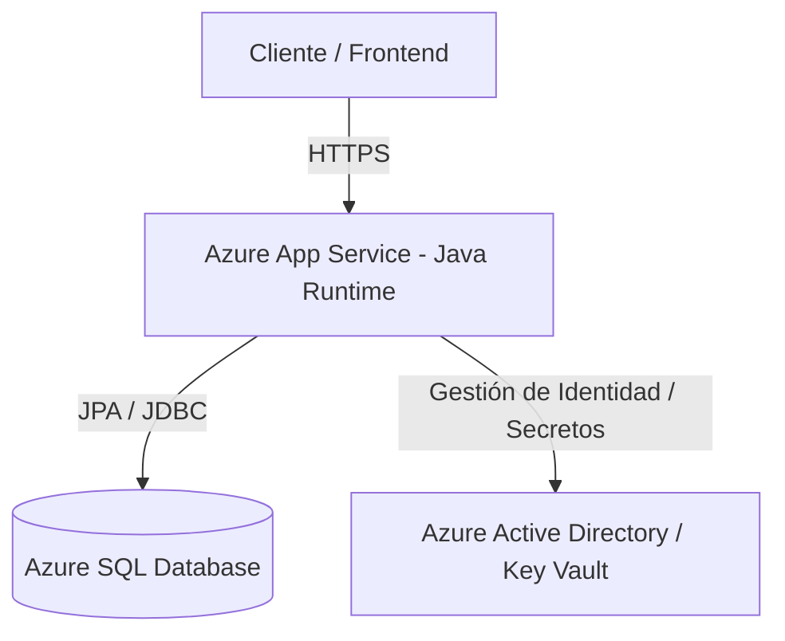

# 🚀 Backend Java & Azure Cloud Architecture

Proyecto práctico desarrollado durante el curso de **Backend con Java y Azure** impartido por **Código Facilito** en colaboración con **Microsoft**. Este repositorio reúne las aplicaciones en Java y la infraestructura desplegada en la nube de Azure.

---

## 📌 Arquitectura e Infraestructura Cloud

La solución actual integra componentes cloud para garantizar persistencia empresarial, seguridad y despliegue continuo:

---

## Recurso Cloud Desplegados

- Azure App Service: Hosting administrado para la ejecución de la aplicación backend en Java.

- Azure SQL Database: Base de datos relacional empresarial configurada con reglas de firewall y persistencia de datos.

- Seguridad & Autenticación: Aplicación de políticas de seguridad, gestión de secrets y control de acceso.

## Módulos Completados

- [x] 1. Introducción al Desarrollo Backend en Azure: Conceptos fundamentales de la nube, modelos de servicio (IaaS, PaaS, SaaS) y herramientas de administración.

- [x] 2. Desarrollo de Backend con Java: Creación de REST APIs robustas utilizando Java y frameworks modernos.

- [x] 3. Azure SQL y Persistencia Empresarial: Configuración de bases de datos relacionales en Azure, conexión mediante ORM/JPA y optimización de consultas.

- [x] 4. Despliegue en Azure App Service: Configuración de planes de App Service, pipelines de publicación y gestión de variables de entorno.

- [x] 5. Seguridad en Aplicaciones Backend: Implementación de mejores prácticas de autenticación, autorización y protección de datos en la nube.

## Próximos Pasos (Roadmap)

- [ ] 6. Contenedores con Azure (Docker & Azure Container Registry)

- [ ] 7. Azure Kubernetes Service (AKS)

- [ ] 8. Integración con otros servicios de Azure

- [ ] 9. DevOps (CI/CD)

- [ ] 10. Buenas Prácticas para Aplicaciones Empresariales

Requisitos Previos e Instalación Local
Requisitos

- JDK 17 o superior

- Maven / Gradle

- Azure CLI (az)

- Azure SQL Database o SQL Server local

### Configuración

1. Clona el repositorio:
git clone [https://github.com/tu-usuario/tu-repositorio.git](https://github.com/tu-usuario/tu-repositorio.git)

2. Configura las variables de entorno para la base de datos en src/main/resources/application.properties:
    spring.datasource.url=${AZURE_SQL_CONNECTION_STRING}
    spring.datasource.username=${AZURE_SQL_USER}
    spring.datasource.password=${AZURE_SQL_PASSWORD}

3. Compila y ejecuta el proyecto:
   /mvnw spring-boot:run

---

## 📸 Evidencia de Despliegue en Azure

Puedes revisar las capturas del panel de control de Azure y los scripts de aprovisionamiento en la carpeta /img.

Status de App Service: [Enlace a captura o archivo]
Tablas e Índices en Azure SQL: [Enlace a captura o script SQL]

---

<ElicitationsGroup message="¿Te gustaría personalizar alguna parte de la documentación para tu repositorio?">
  <Elicitation label="Generar un script de Azure CLI para documentar la creación de recursos" query="¿Puedes darme un script en Azure CLI que simule la creación del Resource Group, el Azure SQL y el App Service para guardarlo en la carpeta docs?"/>
  <Elicitation label="Adaptar la configuración de Spring Boot para Azure SQL" query="¿Cómo debería estructurar el archivo application.properties para conectar Spring Boot con Azure SQL usando variables de entorno de forma segura?"/>
</ElicitationsGroup>

